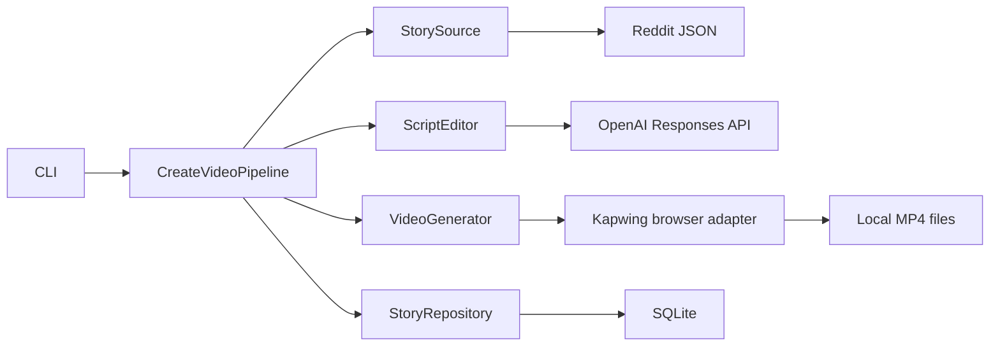

# YouAI

[](https://github.com/pol4xer/youai/actions/workflows/ci.yml)

A Python pipeline for turning Reddit stories into short-form video scripts and
passing them to a replaceable video provider.

YouAI explores the engineering behind content automation: typed provider
boundaries, structured LLM output, browser automation, and transactional storage.
The included offline demo makes the application flow easy to inspect without
accounts or API keys.

**Status:** portfolio prototype. The application core is covered by isolated
tests. The Kapwing browser adapter is experimental and has not been verified
against the current live interface. **YouTube uploading is not implemented.**

## Try the offline demo

From a checkout, with Python 3.12 or 3.13:

```bash
python -m youai --demo
```

No dependency installation or credentials are needed for this command. It uses a
fictional story and deterministic local adapters, runs the same application
pipeline, and writes:

- two JSON storyboards, `part-01.storyboard.json` and `part-02.storyboard.json`,
  to `var/demo/storyboards/`;
- the completed story and asset records to `var/demo/youai.db`.

The demo produces storyboards, not rendered video. It makes no network requests,
opens no browser, and publishes nothing. Run it again to see duplicate detection,
or use a separate output directory:

```bash
python -m youai --demo --demo-dir var/another-demo
```

## How it works



The live path selects the first unprocessed story from a subreddit, asks the
editor for a title and script parts of up to 950 characters, then generates one
video per part. Only after every part succeeds does a single SQLite transaction
record the story and its assets.

The offline demo swaps the source, editor, and video adapter for local fixtures
while retaining the application service and SQLite repository.

## Engineering highlights

| Area | Implementation |
| --- | --- |
| Application design | Immutable domain models, `Protocol` contracts, provider factories, and a small composition root |
| LLM integration | Responses API with strict JSON Schema plus application-side validation |
| Persistence | SQLite transactions, foreign keys, duplicate detection, and compatibility with the earlier schema |
| Browser automation | Explicit waits, timed email verification, isolated downloads, and resource cleanup |
| Testability | Injected HTTP, LLM, browser, and mailbox dependencies; temporary SQLite databases |
| Packaging | Installable wheel, a console entry point, locked dependencies, linting, and package smoke checks |

Start reading at [`application.py`](youai/application.py), then
[`contracts.py`](youai/contracts.py) and [`bootstrap.py`](youai/bootstrap.py).
The [architecture notes](docs/ARCHITECTURE.md) explain the boundaries and failure
behavior.

## Development

For the full dependency environment, use Python 3.12 or 3.13 and Poetry 2:

```bash
poetry install
poetry run youai --demo
make check
```

`make check` runs Ruff, isolated tests, and a wheel build/install/CLI smoke check.
The tests use fake external providers and local files. They do not validate a live
Kapwing session or spend API credits. Initial dependency installation requires
network access.

See [development commands](docs/DEVELOPMENT.md) and
[live provider setup](docs/SETUP.md) for configuration and optional integration
experiments.

## Current boundaries

- The live path needs Reddit access, an OpenAI API key, Chrome/Chromium, and a
  usable Kapwing account. External requests or video generation may incur costs.
- Kapwing and the optional legacy mailbox adapter depend on third-party web
  interfaces. Selectors and sign-in behavior may need maintenance.
- Each run processes one story synchronously. There is no scheduler, concurrent
  job claiming, unattended retry system, or publishing integration.
- If generation stops partway through, completed files can remain on disk. The
  story is saved only after all parts succeed; a later attempt may generate those
  parts again.
- Runtime configuration, databases, downloads, and generated media belong in
  local ignored paths. Use content you have permission to process and publish.
